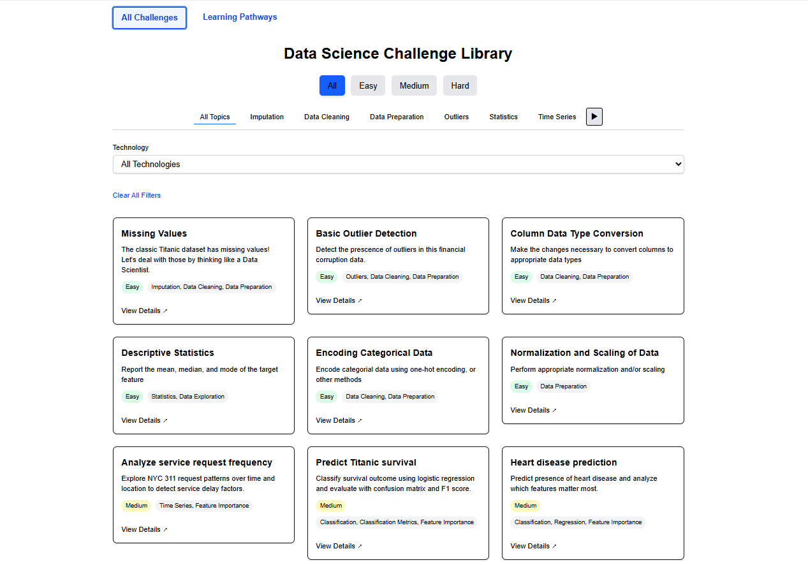
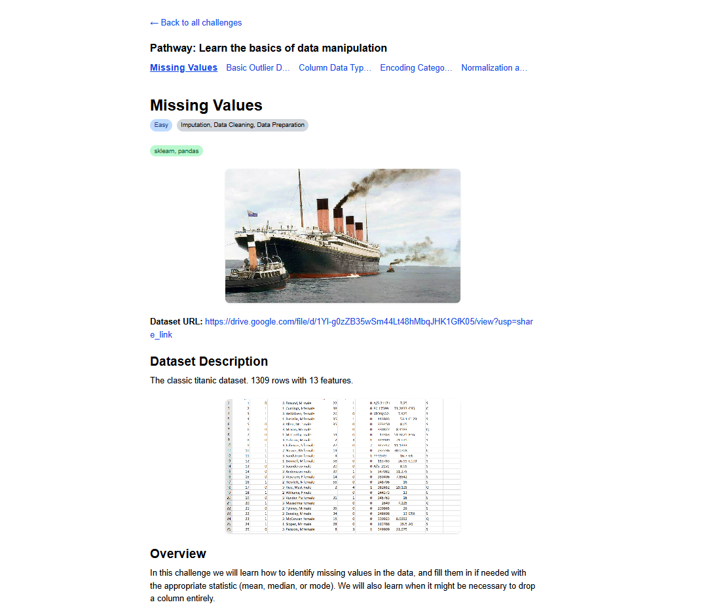
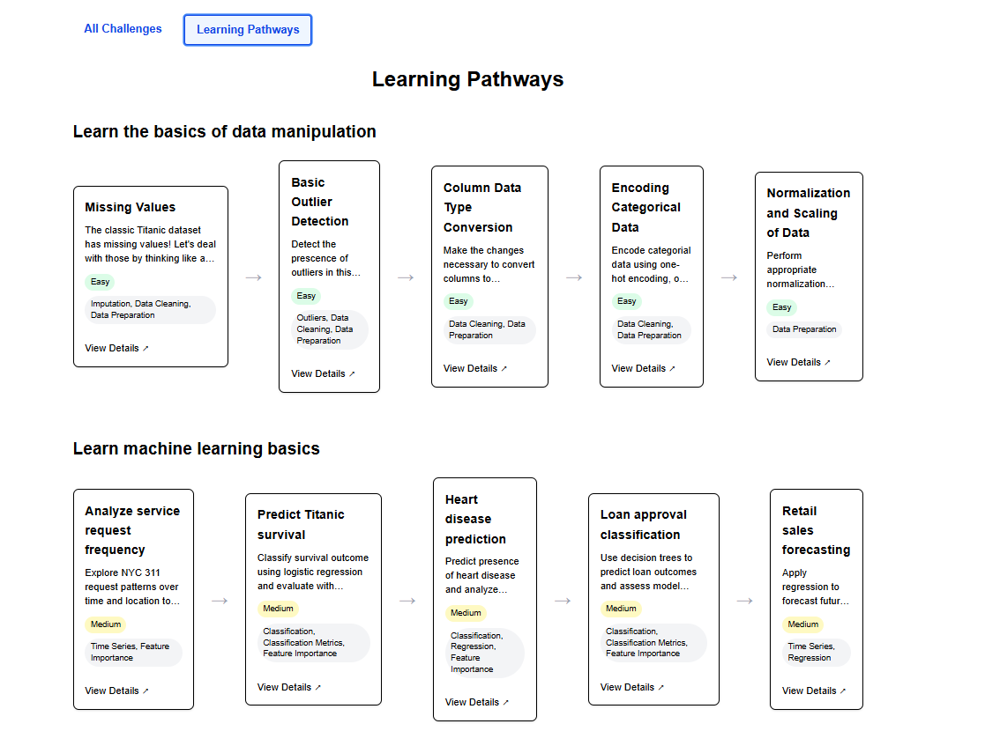

# Data Science Challenge Library (DSCL)

[View Live Site](https://rhemish.github.io/dscl-docs/)

A curated collection of interactive challenges and datasets designed to help students, educators, and data science enthusiasts practice and learn fundamental to advanced AI/ML concepts. Access the live App: [https://dscl.azurewebsites.net](https://dscl.azurewebsites.net)

## Features

- Real-world datasets across classification, regression, NLP, deep learning, etc.
- Challenges organized by difficulty and topic
- Use cases and starter tips to approach each challenge
- Full-stack web app with a Flask backend and Vite + React frontend

---

## Local Setup
**Clone the repository:**

<pre>```bash 
git clone https://github.com/thomasbritnell/DSCL.git 
cd DSCL 
``` </pre>

### Backend Server
**In the first terminal:**

<pre>```bash 
cd backend
python -m venv venv
source venv/bin/activate  # or venv\Scripts\activate on Windows
pip install -r requirements.txt
python app.py
``` </pre>

### Seed the Database
**In the second terminal:**

<pre>```bash 
cd backend
source venv/bin/activate
python seed_data.py
``` </pre>

### Frontend Server
**In the third terminal:**

<pre>```bash 
cd frontend
npm install  # Run once
npm run dev
``` </pre>

Open http://localhost:5173 to view the frontend.

## Screenshots

### Homepage



### Challenge-detail



### Learning pathways



### Project Structure
```
DSCL/
├── backend/ # Flask app and database scripts
├── frontend/ # React + Vite frontend
└── README.md # You're here!
```

### Tech Stack
- Frontend: React + Vite + TailwindCSS
- Backend: Python + Flask + SQLAlchemy
- Database: SQLite (local dev)
- Hosting: Azure (live)

### Future Plans
- Challenge submission + leaderboard
- User auth
- Custom challenge uploads
- AutoML integration

### Contributing
Open an issue or PR. Contributions are welcome!


## License

MIT License  
See [LICENSE](./LICENSE) for details.
